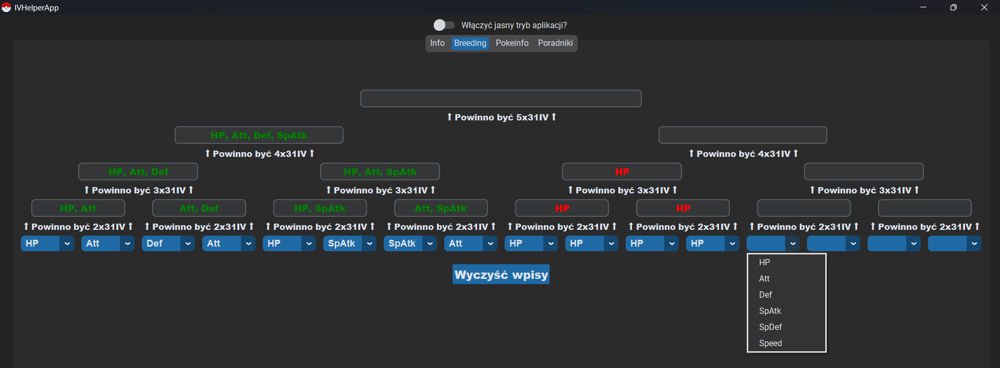
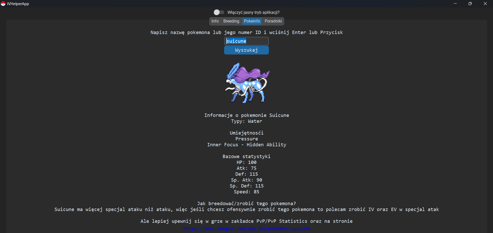

<<<<<<< HEAD
This is a GUI created for Polish PokeMMO players to make Pokémon breeding management easier.
It uses the customtkinter module/library.

## WARNING!
Your antivirus may detect a Trojan while using or opening the application. Unfortunately, I can't fix this issue at the moment — please ignore it!

### Update 2.2:
- Mobile-friendly GUI – you can switch between windows easily.
- Much more visually appealing design, including rounded frames.
- Light and dark modes available.
- Pressing Enter now works while searching for Pokémon information.

=======
To jest GUI stworzone dla polskich graczy PokeMMO w celu ułatwienia kontroli breedowania pokemonów.
Został użyty moduł/biblioteka customtkinter.

Link do pobrania: \
https://www.mediafire.com/file/nowvoxpj5ab47p5/PokeBreederLauncher.rar/file

UWAGA!: \
Podczas pobierania, używania i otwierania aplikacji Antywirus może wykryć trojana, niestety nie potrafię na ten moment
nic z tym zrobić - zignoruj to!

Jak włączyć aplikację?:
1. Rozpakuj pobrany plik.
2. Otwórz folder PokeBreederLauncher i kliknij PokeBreederLauncher.exe.

Update 2.01:
1. Mobilne GUI, można przeskakiwać z okienka na okienko
2. Dużo przyjemniejsza dla oka grafika w tym zaokrąglone ramki
3. Tryby ciemne i jasne - do wyboru
4. Podczas wyszukiwania informacji o pokemonie działa również wciskanie Enter
>>>>>>> 5e9c44194e1d4252025cbb357c5929ca1a44c6f2
